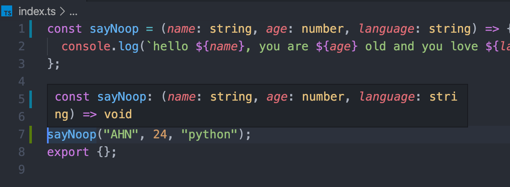

# Typescript
Nomad Coders Course: https://github.com/nomadcoders/typechain


- JavaScript sucks in detecting my mistakes: typescript detects in and tells me if there's an error

- "<argument>?" means it is optional argument

- you can designate types of arguments for the function, prevents future type errors
  

- void: not returning anything from function

- ```
  yarn add tsc-watch --dev
  ```

- 

